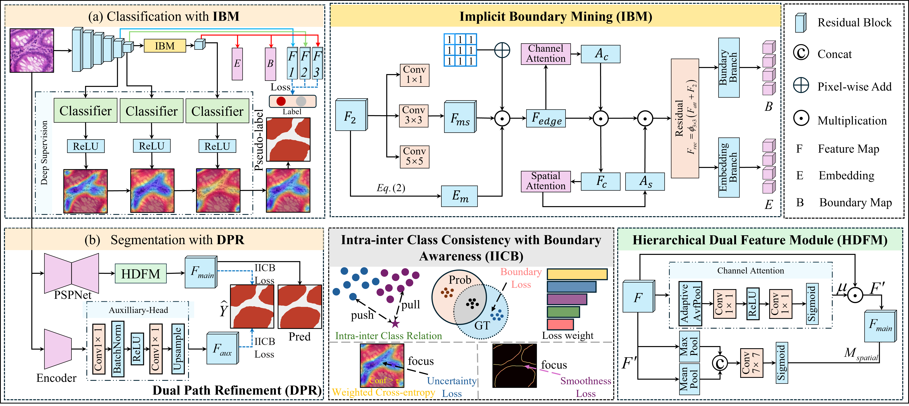

# Weakly Supervised Histopathological Images Segmentation via Implicit Boundary Mining and Dual Path Refinement
<details>
<summary>Read full abstract.</summary>
Accurate segmentation of pathological tissue is essential for characterizing the tumor microenvironment, thereby enabling precise treatment planning and prognostic assessment. However, weakly supervised methods based on image-level labels and class activation maps (CAMs) often suffer from boundary imprecision due to over- or under-activation, particularly in the presence of inter-class homogeneity and intra-class heterogeneity. To address these challenges, we propose an Implicit Boundary Mining (IBM) module that enhances subtle edge cues embedded in deep features to facilitate boundary localization under image-level supervision. To further suppress pseudo-label noise, we introduce a Dual Path Refinement (DPR) architecture guided by an Intra-Inter Class Consistency with Boundary Awareness (IICB) loss. DPR simultaneously predicts tissue regions and refines boundaries via context-aware attention, while IICB promotes semantic consistency and enhances boundary precision. Extensive experiments on three tumor datasets (two public and one in-house) and a public gland dataset demonstrate that our method achieves state-of-the-art performance among weakly supervised approaches. Moreover, few-shot domain adaptation results highlight its strong generalization capability with minimal retraining, underscoring its practical value in real-world clinical applications.
</details>

# Framework



# Usage

## Pretrained weights

Download the pretained weight of classification stage via Google Cloud Drive ([Link)](https://drive.google.com/file/d/10wic04KljWVPhujaujrKak4iIgjm3d5m/view?usp=drive_link) And put it into init_weights.

## Dataset

<pre>
IBDR/
└── datasets/
    ├── GlaS/
    │   ├── train/
    │   │   └── img/
    │   ├── val/
    │   │   ├── img/
    │   │   └── mask/
    │   └── test/
    │       ├── img/
    │       └── mask/
    ├── Digestpath/
    │   ├── train/
    │   │   └── img/
    │   ├── val/
    │   │   ├── img/
    │   │   └── mask/
    │   └── test/
    │       ├── img/
    │       └── mask/
    ├── HPH/
    │   ├── train/
    │   │   └── img/
    │   ├── val/
    │   │   ├── img/
    │   │   └── mask/
    │   └── test/
    │       ├── img/
    │       └── mask/
    └── Wien/
        ├── train/
        │   └── img/
        ├── val/
        │   ├── img/
        │   └── mask/
        └── test/
            ├── img/
            └── mask/
</pre>

## Run each step:

1、Train the classification model and generate pesudo masks with the image-level label:

```python
python 1_train_stage1.py
```

2、Train the segmentation model with pesudo masks:

```python
python 2_train_stage2.py
```

3、Inference of unlabeled data using the checkpoint obtained in the segmentation stage:

```python
python inference.py
```

